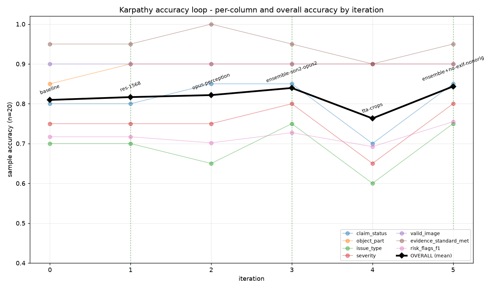

# Karpathy Accuracy Loop - Iteration Report

Each row is one experiment, measured on the 20 labeled sample rows. `overall` is the unweighted mean of the six exact-match column accuracies and the risk_flags micro-F1. `kept` marks a config adopted as the new running best. See `accuracy_iterations.png` for the trend.

| iter | name | overall | claim_status | object_part | issue_type | severity | valid_image | evidence | risk_F1 | kept | change |
|---|---|---|---|---|---|---|---|---|---|---|---|
| 0 | baseline | **0.810** *(new best)* | 0.800 | 0.850 | 0.700 | 0.750 | 0.900 | 0.950 | 0.717 | - | 1024px, Sonnet k=3, part-extraction, issue-severity (commit 7347da0) |
| 1 | res-1568 | **0.817** *(new best)* | 0.800 | 0.900 | 0.700 | 0.750 | 0.900 | 0.950 | 0.717 | yes | IMAGE_MAX_EDGE 1024->1568 (Claude native ceiling) |
| 2 | opus-perception | **0.822** *(new best)* | 0.850 | 0.900 | 0.650 | 0.750 | 0.900 | 1.000 | 0.702 | - | MODEL_PERCEPTION=opus-4-8, 1568px, k=3 |
| 3 | ensemble-son2-opus2 | **0.840** *(new best)* | 0.850 | 0.900 | 0.750 | 0.800 | 0.900 | 0.950 | 0.727 | yes | PERCEPTION_ENSEMBLE sonnet:2+opus:2, 1568px |
| 4 | tta-crops | **0.763** | 0.700 | 0.900 | 0.600 | 0.650 | 0.900 | 0.900 | 0.692 | - | PERCEPTION_TTA Sonnet k=3 + 5 zoom crops, 1568px |
| 5 | ensemble+no-exif-nonorig | **0.844** *(new best)* | 0.850 | 0.900 | 0.750 | 0.800 | 0.900 | 0.950 | 0.755 | yes | ensemble + drop EXIF editor-tag non_original (research #6) |

**Best so far:** iter 5 (ensemble+no-exif-nonorig) at overall **0.844**.
